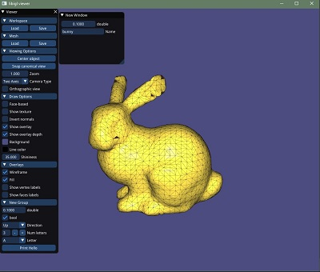

# Tutorial 1 - Coding Framework

In this tutorial, we introduce a framework to do basic mesh IO and visualization. Note that we mainly focus on Python this year. C++ framework is provided as the 2nd option.

---
# Content

## (I) Python Framework

### 1. [Installation and display mesh](python/1_install)  
### 2. [Visualize points, edges, and mesh](python/2_visualize/2_visualization.ipynb)  
### 3. [Work with MeshLab](python/3_meshlab/3_meshlab.ipynb)  
### 4. Trimesh Quickstart and neighboring travel examples 
   + [Trimesh Quickstart](python/4_travel)  
   + [Access Neighbors examples ](python/4_travel/4_travel.ipynb)  
### 5. [Keyboard events](python/5_keyboard/5_keyboard.ipynb)

---
## (II) Python Practices - Nieghboring face/vertices/edges traveling 
### [Calculate Euler number](python/6_practices/euler_number.ipynb)
### [Display vertices normals and change colors](python/6_practices/vis_nv.ipynb)  

           

---  
## (III) C++ Framework

### 1. [Installation](cpp/1_install )
### 2. [Simple Viewer and LibIGL](cpp/2_libigl )
### 3. [Visualize points/edges/mesh and access neighbors](cpp/3_travel)

  
___
# How to get helps?

Please post your question on github's issue page. TA team will reply. 
